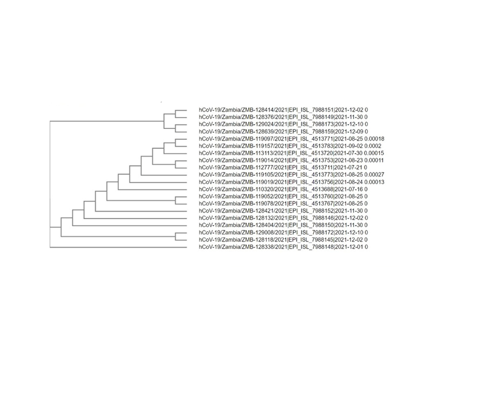
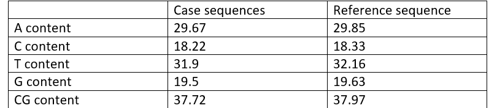

# Comparison-between-SARS-COV2-and-Omicron

## 1. Multiple sequence aligment

Clustal Omega was used to align 10 delta sequences, will be referred to as reference sequences,  and the 10 Omicron sequences ,will be referred to as case sequences.

## 2. Phylogenetic tree

Clustal Omega was used to, first, align the 20 sequences together then obtain the phylogenetic tree.

## 3. Consensus sequence
A new fasta file was created that contains the consensus sequence from the 10 case sequences.

## 4. The average percentage of the chemical constituents (C, G, T, and A) and the CG content
They were obtained for the 10 Omicron sequences and the consensus sequence.

## 5. Dissimilar regions:
They were obtained and saved in an excel file.
